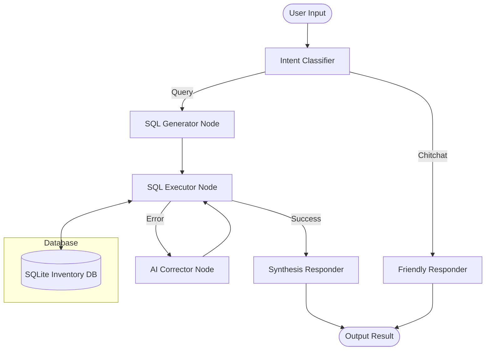
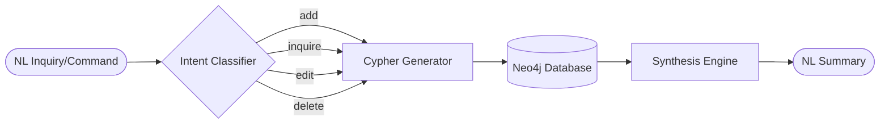

# 🏗️ NEXUS Project Architecture Diagrams

## 1. Inventory Chatbot (SQL State Machine)
This diagram illustrates the graph-based state machine approach used for the SQL Inventory Bot.

---

## 2. Knowledge Graph Agent (Neo4j CRUD)
This diagram illustrates the flow for translating natural language into graph operations.

