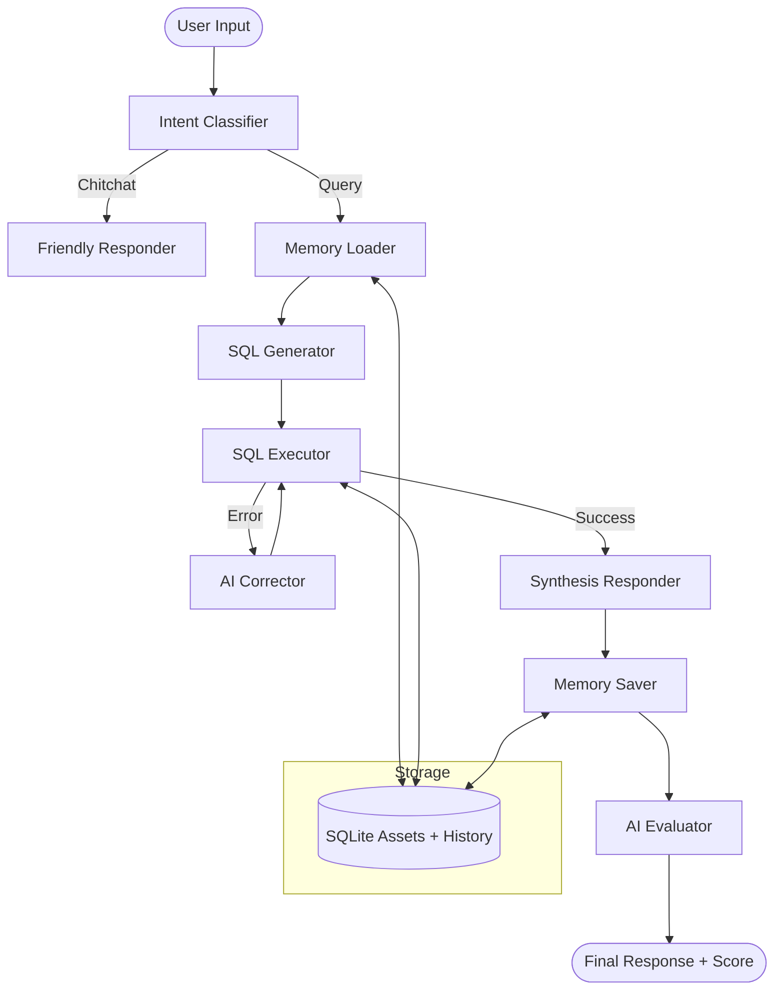
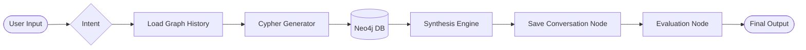
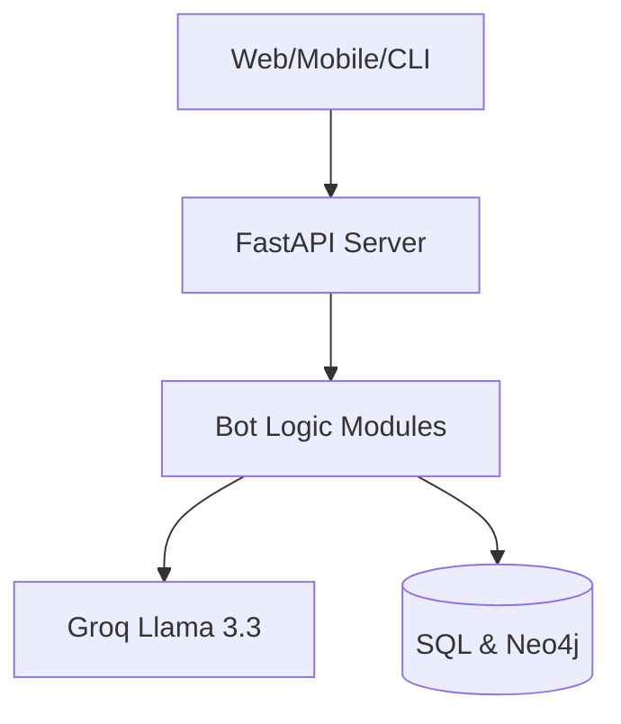

# 🏗️ NEXUS Advanced Architecture

## 1. Inventory Bot (SQL + Memory + Eval)

```mermaid
graph TD
    User([User Input]) --> Intent[Intent Classifier]
    Intent -- Chitchat --> Resp[Friendly Responder]
    Intent -- Query --> Mem[Memory Loader]
    
    Mem --> Gen[SQL Generator]
    Gen --> Exec[SQL Executor]
    Exec -- Error --> Corr[AI Corrector]
    Corr --> Exec
    
    Exec -- Success --> Synth[Synthesis Responder]
    Synth --> Save[Memory Saver]
    Save --> Eval[AI Evaluator]
    Eval --> End([Final Response + Score])
    
    subgraph Storage
        DB[(SQLite Assets + History)]
    end
    Mem <--> DB
    Exec <--> DB
    Save <--> DB
```

## 2. Knowledge Graph Agent (Neo4j + Graph Memory)

```mermaid
graph LR
    Input([User Input]) --> Classify{Intent}
    Classify --> Mem[Load Graph History]
    Mem --> Gen[Cypher Generator]
    Gen --> Neo[(Neo4j DB)]
    Neo --> Synth[Synthesis Engine]
    Synth --> Save[Save Conversation Node]
    Save --> Eval[Evaluation Node]
    Eval --> Output([Final Output])
```

## 3. API Architecture

```mermaid
graph TD
    Client[Web/Mobile/CLI] --> API[FastAPI Server]
    API --> Logic[Bot Logic Modules]
    Logic --> Groq[Groq Llama 3.3]
    Logic --> Databases[(SQL & Neo4j)]
```
