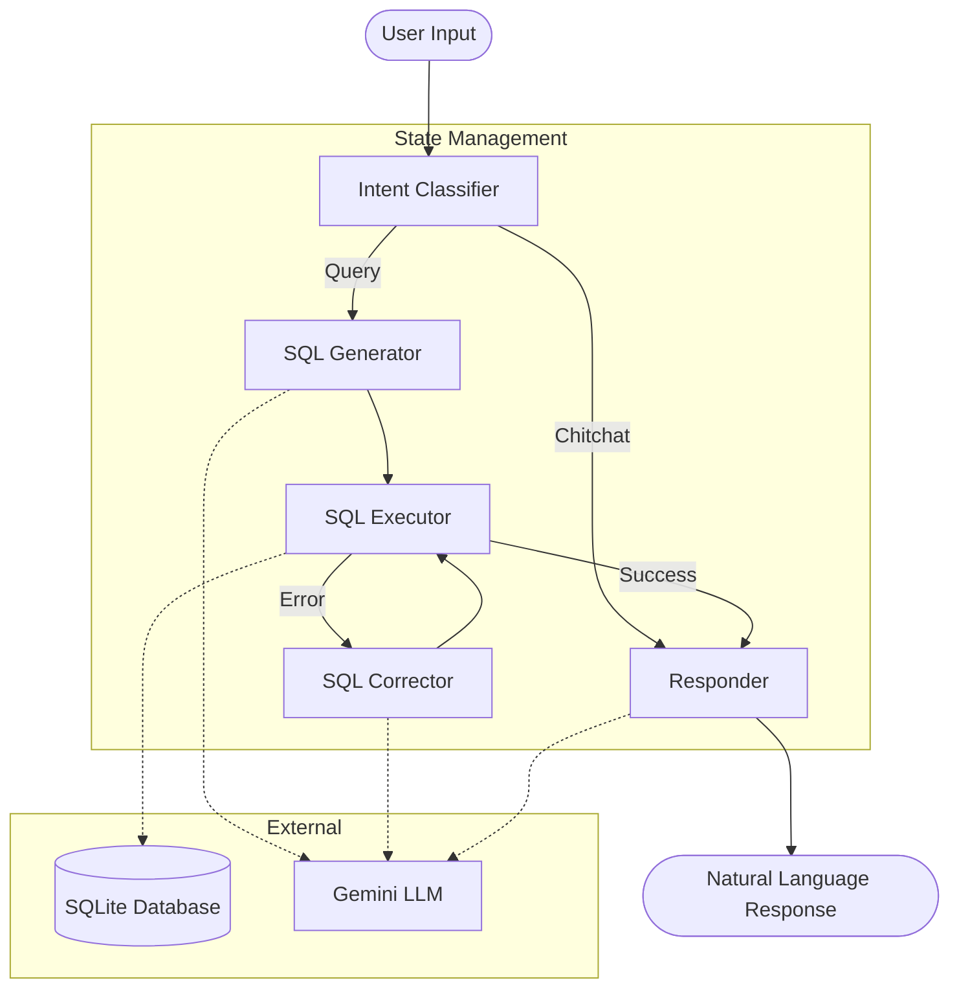
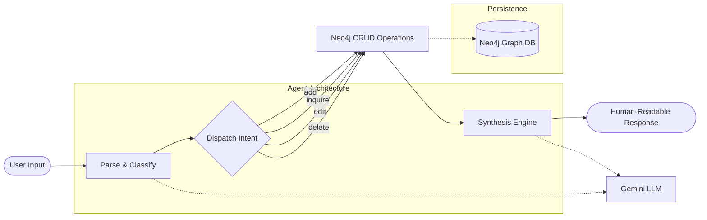

# System Architecture Diagrams

## 1. Inventory Chatbot (SQL) - LangGraph State Machine

```mermaid
graph TD
    User([User Input]) --> Intent[Intent Classifier]
    Intent -- "Chitchat" --> Responder[Responder]
    Intent -- "Query" --> Generator[SQL Generator]
    
    Generator --> Executor[SQL Executor]
    Executor -- "Success" --> Responder
    Executor -- "Error" --> Corrector[SQL Corrector]
    
    Corrector --> Executor
    Responder --> Output([Natural Language Response])
    
    subgraph "State Management"
        Intent
        Generator
        Executor
        Corrector
        Responder
    end
    
    subgraph "External"
        SQLite[(SQLite Database)]
        LLM[Gemini LLM]
    end
    
    Generator -.-> LLM
    Executor -.-> SQLite
    Corrector -.-> LLM
    Responder -.-> LLM
```

## 2. Knowledge Graph Chatbot (Neo4j) - Intent-Based Agent

```mermaid
graph LR
    Input([User Input]) --> Parse[Parse & Classify]
    Parse --> Dispatch{Dispatch Intent}
    
    Dispatch -- "add" --> CRUD[Neo4j CRUD Operations]
    Dispatch -- "inquire" --> CRUD
    Dispatch -- "edit" --> CRUD
    Dispatch -- "delete" --> CRUD
    
    CRUD --> Synthesis[Synthesis Engine]
    Synthesis --> Response([Human-Readable Response])
    
    subgraph "Agent Architecture"
        Parse
        Dispatch
        Synthesis
    end
    
    subgraph "Persistence"
        Neo4j[(Neo4j Graph DB)]
    end
    
    CRUD -.-> Neo4j
    Parse -.-> LLM[Gemini LLM]
    Synthesis -.-> LLM
```
